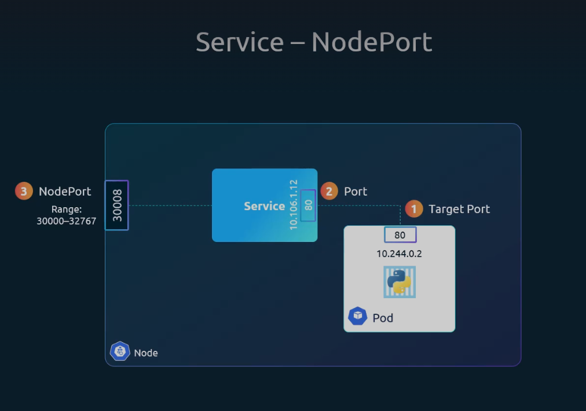

Service Types:
1. NodePort Service
2. ClusterIp
3. LoadBalancer


1. NodePort Service: 
Pod has a port which is known as `Target Port`
Pod connects to Service with  a name `Port`
this service is connected to a `Node Port` (Range: 30000-32767)



```sh
apiVersion: v1
kind: Service
metadata:
spec:
    type: NodePort
    ports: # it takes list of array
    - targetPort: 80 # optional
      port: 80 # it must be defined
      nodePort: 30080 # optional

    selector: # we have to add the selector to work on which pod 
        app: myapp
        type: front-end 
```